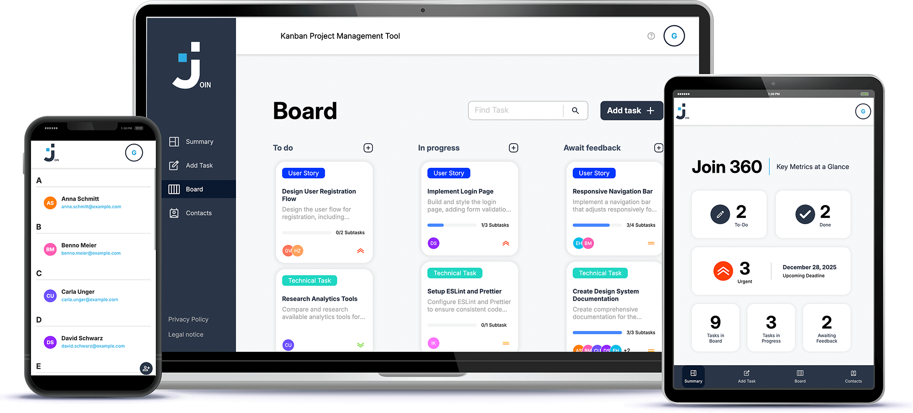

# JOIN: Kanban Tool

**JOIN** is a web application developed as part of a student group project. This project is intended for educational purposes only and is not designed for commercial use or extensive personal use.

## Purpose

- Organize tasks, manage workflows, and improve productivity
- Gain practical experience with web development, teamwork, and agile methodologies
- Learn how to build interactive, data-driven web applications

## Features

Join provides an intuitive drag-and-drop interface and additional productivity tools:

- **Task Management:** Create, edit, and delete tasks
- **Subtasks:** Create, track, and mark subtasks as done
- **Kanban Workflow:** Move tasks between stages such as _To-Do_, _In Progress_, _Awaiting Feedback_, and _Done_
- **Due Dates:** Set and manage deadlines for tasks
- **Contact Management:** Add, edit, and delete contacts
- **Task Assignment:** Assign contacts to tasks
- **User Management:** Register and login as a user
- **Responsiveness:** Works across desktop, tablet, and mobile devices

## Technologies Used

- **Frontend:** HTML5, CSS3, JavaScript
- **Backend / Database:** Firebase Realtime Database

## Installation

To get a local copy of the project up and running, follow these steps:

1. clone the repository
2. replace the Firebase URL with your own Firebase Realtime Database URL
3. open the `index.html` file in your browser

## Contact

For questions or feedback, please contact:

- Email: <info@natgian.com>
- GitHub: [natgian](https://github.com/natgian)
